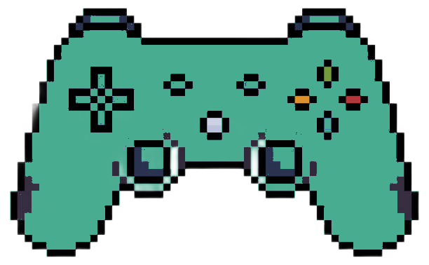
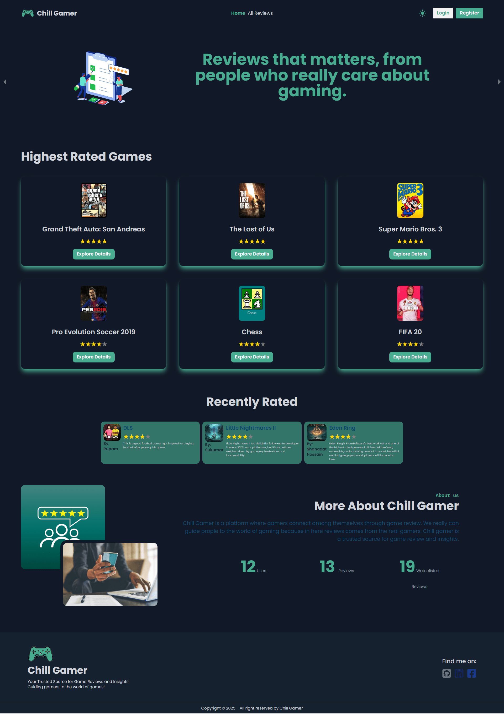

<h1> Chill Gamer</h1>

<strong>A responsive single-page application</strong> for reviewing games, built using the <strong>MERN stack</strong>. Users can explore, add, update, and manage game reviews while enjoying an intuitive interface with authentication and theme toggling.

<h2>🚀 Technologies Used</h2>

  
  
  
  
  
  

<h2>✨ Core Features</h2>
<ul>
  <li>✅ Browse and view user-added game reviews, including <strong>top-rated</strong> and <strong>recently reviewed</strong> games.</li>
  <li>✅ <strong>User Authentication</strong> using Google Firebase (Login & Registration).</li>
  <li>✅ <strong>CRUD Operations</strong>: Users can add, update, and delete their game reviews.</li>
  <li>✅ <strong>Watchlist Feature</strong>: Save favorite reviews to a personal watchlist.</li>
  <li>✅ <strong>Dark/Light Theme Toggle</strong> for an enhanced user experience.</li>
  <li>✅ Fully <strong>responsive design</strong>, optimized for both mobile and desktop.</li>
</ul>

<h2>📦 Dependencies</h2>
<ul>
  <li><strong>Frontend:</strong>
    <ul>
      <li>react (^18.3.1)</li>
      <li>react-dom (^18.3.1)</li>
      <li>react-router-dom (^6.28.0)</li>
      <li>react-icons (^5.4.0)</li>
      <li>react-tooltip (^5.28.0)</li>
      <li>sweetalert2 (^11.14.5)</li>
    </ul>
  </li>
  <li><strong>Authentication:</strong>
    <ul>
      <li>firebase (^11.0.2)</li>
    </ul>
  </li>
  <li><strong>Styling:</strong>
    <ul>
      <li>tailwindcss (^3.4.16)</li>
      <li>daisyui (^4.12.14)</li>
    </ul>
  </li>
</ul>

<em>(Full dependencies list available in <code>package.json</code>.)</em>

<h2>🛠️ Installation & Running Locally</h2>

Follow these steps to set up <strong>Chill Gamer</strong> on your local machine:

<h3>1️⃣ Clone the Repository</h3>
<pre><code>git clone https://github.com/ashis263/chill-gamer.git
cd chill-gamer</code></pre>

<h3>2️⃣ Install Dependencies</h3>
<pre><code>npm install</code></pre>

<h3>3️⃣ Set Up Environment Variables</h3>

Create a <code>.env.local</code> file and add the following:

<pre><code>VITE_apiKey=YOUR_FIREBASE_API_KEY
VITE_authDomain=YOUR_FIREBASE_AUTH_DOMAIN
VITE_projectId=YOUR_FIREBASE_PROJECT_ID
VITE_storageBucket=YOUR_FIREBASE_STORAGE_BUCKET
VITE_messagingSenderId=YOUR_FIREBASE_MESSAGING_SENDER_ID
VITE_appId=YOUR_FIREBASE_APP_ID</code></pre>

<em>(Replace with your actual Firebase credentials.)</em>

<h3>4️⃣ Start the Development Server</h3>
<pre><code>npm run dev</code></pre>

The project will run at <code>http://localhost:5173/</code> by default.

<h2>🌐 Live Demo</h2>
<ul>
  <li>🚀 <a href="https://chill-gamer-7df90.web.app/">Firebase Deployment</a></li>
  <li>🚀 <a href="https://chill-gamer-ashis263.netlify.app/">Netlify Deployment</a></li>
  <li>🚀 <a href="https://chill-gamer-ashis263.surge.sh/">Surge Deployment</a></li>
</ul>

<h2>📸 Screenshot</h2>

<h2>🤝 Contribution</h2>

Feel free to fork the repository and submit a pull request. For major changes, please open an issue first to discuss what you’d like to improve.

